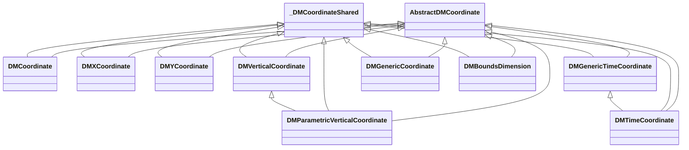
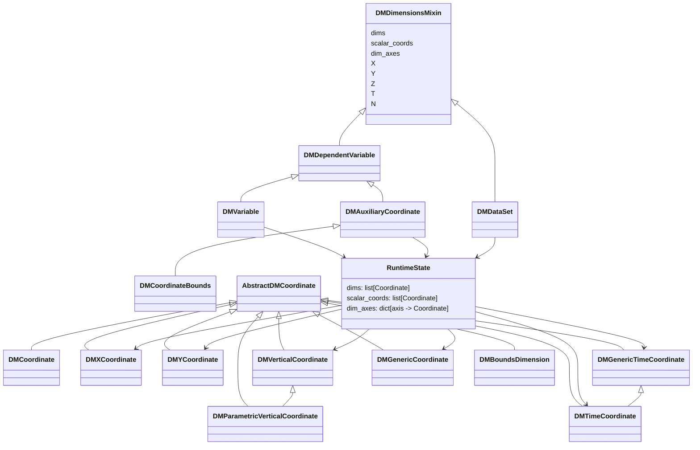
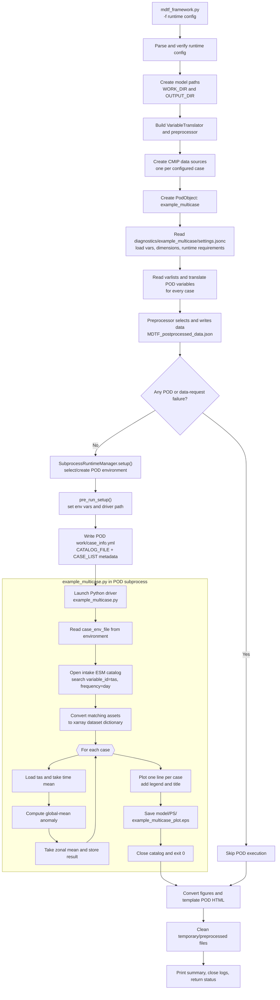
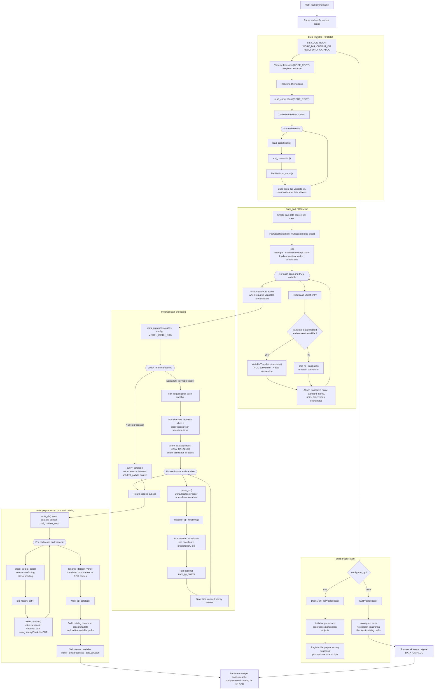

## Coordinate model cheat sheet

[NOTE: Generated by Github Copilot. TO BE VETTED.]
1) Axis labels

```
X = longitude / x-dimension
Y = latitude / y-dimension
Z = vertical dimension
T = time dimension
N = generic "other" dimension
BOUNDS = bounds placeholder
OTHER = unspecified axis
```

---

2) Main idea

```
self.dims = [coord1, coord2, coord3, ...]
```

self.dims is a list of coordinate objects, not strings.

Each element is a coordinate instance, such as:

* DMXCoordinate
* DMYCoordinate
* DMVerticalCoordinate
* DMGenericTimeCoordinate
* DMTimeCoordinate
* DMGenericCoordinate

Then:

```
self.dim_axes = {
    'X': coord_for_X,
    'Y': coord_for_Y,
    'Z': coord_for_Z,
    'T': coord_for_T,
    'N': coord_for_N,
}
```

So:

* self.X means “the x coordinate object”
* self.T means “the time coordinate object”

---

3) Class hierarchy




---

4) Why mixed types are normal

```
different axis types need different metadata

X / Y  -> spatial metadata
Z      -> positive/up-down orientation
T      -> calendar, range, frequency
N      -> generic extra dimension
```

So a variable can legitimately have coordinates like:

```
[
    DMXCoordinate(...),
    DMYCoordinate(...),
    DMVerticalCoordinate(...),
    DMTimeCoordinate(...)
]
```

This is not “bad design”; it is expected.

---

5) Conversion pattern

```
generic coord
↓
recognized as a particular axis
↓
converted to specialized coord class

```

Example:

```
DMCoordinate
    -> recognized as time
    -> DMGenericTimeCoordinate
    -> maybe DMTimeCoordinate

DMCoordinate
    -> recognized as X
    -> DMXCoordinate
```

This is what change_coord(...) does: it swaps the old coordinate object for a new one and then rebuilds the axis maps.

find old coord
build a new coord object
replace it in self.dims
rebuild axis lookups
One-line summary
DM = Data Model; the project uses a shared abstract coordinate interface plus specialized subclasses for X/Y/Z/T/N so each axis can carry the metadata it actually needs.

---

6) One-line summary


```
DM = Data Model; the model uses a shared abstract coordinate interface plus specialized subclasses for X/Y/Z/T/N so each axis can carry the metadata it actually needs.
```

---

More Class Diagrams



## MDTF framework flow: `example_multicase`



---

## Detailed translator and preprocessor flow


